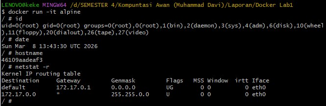
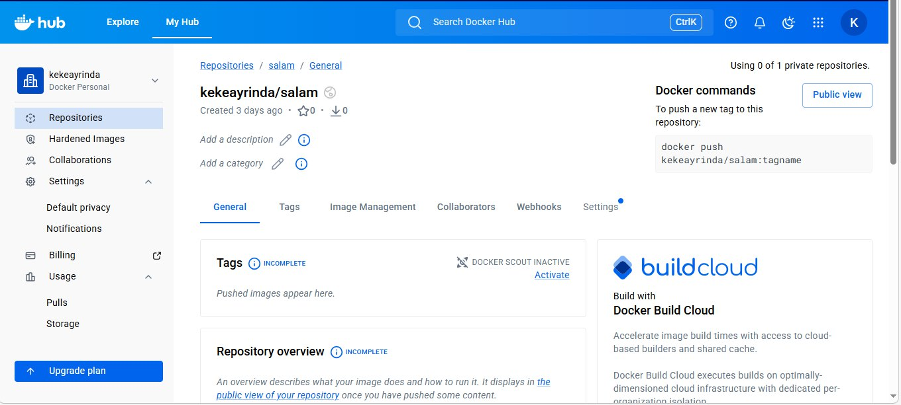
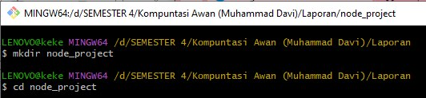
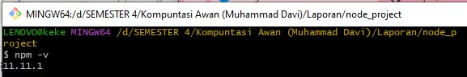
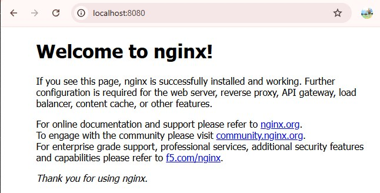
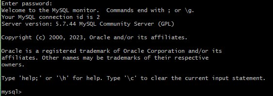

## LAPORAN CLOUD COMPUTING

### Disusun Oleh:  
Nama               : Keke Ayrinda  
NIM                : 2024903430012  
Kelas              : TRKJ-2A

### Program Studi Teknologi Rekayasa Komputer Jaringan
### Jurusan Teknologi Informasi dan Komputer
### Politeknik Negeri Lhokseumawe
### 2026

---

## Lembar Pengesahan

| No. Praktikum     | : | Lab 1 |
|------------------:|:-:|:--------------|
| Judul Praktikum   | : | Dasar-Dasar Docker (Docker Image, Container, dan Docker Hub) |
| Tanggal Praktikum | : | 05 Maret 2026|
| Tanggal Penyerahan| : | 10 Maret 2026 |
| Nama Praktikan    | : | Keke Ayrinda |
| NIM/Kelas Praktikan| : | 2024903430012 / TRKJ-2A |
| Nilai Praktikum   | : | .......................... |
| Dosen Pengampu    | : | Muhammad Davi, S.Kom., M.Cs. |

Mengetahui,  
Dosen Pengampu
     

Muhammad Davi, S.Kom., M.Cs.

## Daftar Isi
- [Lembar Pengesahan](#lembar-pengesahan)
- [Daftar Isi](#daftar-isi)
- [Tujuan Praktikum](#tujuan-praktikum)
- [Dasar Teori](#dasar-teori)
- [Alat dan Bahan](#alat-dan-bahan)
- [Langkah Kerja](#langkah-kerja)
- [Hasil dan Pembahasan](#hasil-dan-pembahasan)
- [Kesimpulan](#kesimpulan)
- [Analisa](#Analisa)
- [Referensi](#referensi)
---

## A. Tujuan Praktikum
Tujuan dari praktikum ini adalah untuk memahami konsep dasar container menggunakan Docker serta cara mengelola image dan container. Selain itu, praktikum ini bertujuan agar mahasiswa mampu menjalankan container sederhana, membuat image Docker sendiri, serta menyimpan image tersebut ke Docker Hub. Mahasiswa juga diharapkan dapat memahami cara menjalankan aplikasi berbasis container menggunakan berbagai konfigurasi seperti volume, multi container, dan docker-compose.

## B. Dasar Teori
Docker merupakan platform containerization yang digunakan untuk membuat, menjalankan, dan mengelola aplikasi di dalam container. Container adalah lingkungan virtual ringan yang berisi semua dependensi yang diperlukan oleh sebuah aplikasi sehingga aplikasi dapat berjalan secara konsisten di berbagai sistem operasi.

Docker menggunakan konsep image dan container. Image merupakan template yang berisi sistem operasi, library, serta aplikasi yang dibutuhkan. Sedangkan container adalah instance yang berjalan dari sebuah image. Dengan menggunakan Docker, proses deployment aplikasi menjadi lebih cepat, ringan, dan konsisten dibandingkan dengan virtual machine.

Docker juga menyediakan layanan Docker Hub, yaitu repository online yang digunakan untuk menyimpan dan membagikan Docker image kepada pengguna lain. Dengan Docker Hub, pengguna dapat melakukan pull atau push image dengan mudah.

Dalam pengembangan aplikasi modern, Docker sering digunakan bersama teknologi lain seperti Node.js, database container, serta docker-compose untuk menjalankan beberapa container sekaligus dalam satu sistem.

## C. Alat dan Bahan
Alat dan bahan yang digunakan dalam praktikum ini adalah sebagai berikut:

1. Laptop atau komputer yang telah terinstal sistem operasi Linux/Windows.

2. Docker Engine yang telah terinstal pada sistem.

3. Akses internet untuk mengunduh Docker image dari Docker Hub.

4. Docker Hub account untuk menyimpan dan membagikan image.

5. Terminal atau command line.

6. Text editor seperti VSCode atau Nano untuk membuat file program dan Dockerfile.

7. Node.js dan npm untuk menjalankan aplikasi berbasis Node.js.

## D. Langkah Kerja
1. Memeriksa instalasi Docker dengan menjalankan perintah:
docker version

2. Memeriksa daftar image yang tersedia pada sistem:
docker images

3. Menjalankan container menggunakan image hello-world:
docker run hello-world

4. Mengunduh image Linux Alpine dari Docker Hub:
docker pull alpine

5. Menjalankan container Alpine dalam mode interaktif:
docker run -it alpine

6. Membuat akun pada Docker Hub dan membuat repository baru.

7. Membuat program sederhana menggunakan bahasa Go dan membuat file Dockerfile.

8. Membangun Docker image menggunakan perintah:
docker build -t username/salam .

9. Login ke Docker Hub dan mengunggah image:
docker login
docker push username/salam

10. Menjalankan image dari Docker Hub menggunakan perintah:
docker run username/salam

## E. Hasil dan Pembahasan
Hasil
Lab1.1: Docker Image "hello-world" :
Perintah docker version digunakan untuk memastikan Docker telah terinstal dengan benar. Saat menjalankan docker run hello-world, Docker secara otomatis melakukan pull image dari Docker Hub jika belum tersedia di lokal. Hasil pada docker images menunjukkan bahwa image berhasil diunduh dan siap digunakan.

Hasil Lab 1.2 : Shell :
Perintah docker search alpine dan docker pull alpine digunakan untuk mencari dan mengunduh image Alpine. Selanjutnya, docker run -it alpine menjalankan container dalam mode interaktif sehingga dapat digunakan seperti sistem operasi Linux. Perintah seperti id, date, dan hostname menunjukkan bahwa container berjalan dengan baik. Perbedaan docker ps dan docker ps -a menunjukkan container aktif dan riwayat container.

Hasil Lab 1.3 : Membuat Akun di Docker Hub :
Pembuatan akun Docker Hub berhasil dilakukan sebagai sarana penyimpanan dan distribusi image. Repository yang dibuat dapat digunakan untuk menyimpan image agar dapat diakses kembali atau dibagikan ke pengguna lain.

Hasil Lab 1.4 : Membuat Image baru dan Menyimpan di Docker
Hub :
Pembuatan file salam.go dan Dockerfile menunjukkan proses pembuatan aplikasi sederhana berbasis Golang. Perintah docker build digunakan untuk membuat image dari Dockerfile. Hasil docker images membuktikan bahwa image berhasil dibuat dan siap untuk dijalankan atau di-push ke Docker Hub.

## F. Kesimpulan
Docker merupakan teknologi container yang sangat berguna untuk menjalankan aplikasi dalam lingkungan yang terisolasi. Docker mempermudah proses instalasi, deployment, dan distribusi aplikasi melalui penggunaan image dan container. Dengan adanya Docker Hub, pengguna juga dapat menyimpan dan membagikan image dengan mudah sehingga proses pengembangan aplikasi menjadi lebih efisien.

## G. Analisa
Docker berhasil digunakan untuk menjalankan image seperti hello-world dan memahami proses pull secara otomatis dari Docker Hub. Penggunaan container berbasis Alpine menunjukkan bahwa container dapat berfungsi seperti sistem operasi yang terisolasi. Selain itu, pembuatan dan penyimpanan image ke Docker Hub membuktikan bahwa Docker memudahkan distribusi aplikasi secara efisien.

## H. Referensi
1. Muhammad Davi. Modul Praktikum Cloud Computing – Docker. Politeknik Negeri Lhokseumawe, 2024.
2. Docker Inc. (2023). Docker Documentation. https://docs.docker.com
3. Node.js. (2023). Node.js Official Documentation. https://nodejs.org
4. Express.js. (2023). Express Framework Documentation. https://expressjs.com

---

## Lembar Pengesahan

| No. Praktikum     | : | Lab 2 |
|------------------:|:-:|:--------------|
| Judul Praktikum   | : | Pembuatan dan Deployment Aplikasi Node.js Menggunakan Docker |
| Tanggal Praktikum | : | 02 April 2026|
| Tanggal Penyerahan| : | 09 April 2026 |
| Nama Praktikan    | : | Keke Ayrinda |
| NIM/Kelas Praktikan| : | 2024903430012 / TRKJ-2A |
| Nilai Praktikum   | : | .......................... |
| Dosen Pengampu    | : | Muhammad Davi, S.Kom., M.Cs. |

Mengetahui,  
Dosen Pengampu
     

Muhammad Davi, S.Kom., M.Cs.

## Daftar Isi
- [Lembar Pengesahan](#lembar-pengesahan)
- [Daftar Isi](#daftar-isi)
- [Tujuan Praktikum](#tujuan-praktikum)
- [Dasar Teori](#dasar-teori)
- [Alat dan Bahan](#alat-dan-bahan)
- [Langkah Kerja](#langkah-kerja)
- [Hasil dan Pembahasan](#hasil-dan-pembahasan)
- [Kesimpulan](#kesimpulan)
- [Analisa](#Analisa)
- [Referensi](#referensi)
---

## A. Tujuan Praktikum
Memahami proses pembuatan dan pengelolaan aplikasi berbasis container menggunakan Docker, khususnya pada proyek Node.js. Mahasiswa diharapkan mampu membuat aplikasi sederhana menggunakan Node.js dan Express, kemudian mengkonfigurasinya ke dalam Dockerfile untuk dijadikan sebuah image. Selain itu, praktikum ini bertujuan agar mahasiswa dapat melakukan build image, menjalankan container dengan pengaturan port dan mode daemon, serta memahami cara menyimpan (push) dan mengambil (pull) image dari Docker Hub. Dengan demikian, mahasiswa dapat mengimplementasikan konsep containerization dalam pengembangan dan distribusi aplikasi secara efektif.

## B. Dasar Teori
Docker merupakan platform containerization yang digunakan untuk mengemas aplikasi beserta seluruh dependensinya ke dalam sebuah container sehingga dapat dijalankan secara konsisten di berbagai lingkungan. Dengan menggunakan Docker, proses pengembangan, pengujian, dan deployment aplikasi menjadi lebih efisien karena tidak bergantung pada konfigurasi sistem host.

Dalam praktikum ini digunakan Node.js sebagai runtime environment untuk menjalankan aplikasi berbasis JavaScript di sisi server. Framework Express digunakan untuk mempermudah pembuatan server web sederhana dengan menangani request dan response. Aplikasi Node.js yang dibuat kemudian dikonfigurasi dalam sebuah file bernama package.json yang berisi informasi proyek dan dependensi yang dibutuhkan.

Untuk mengubah aplikasi menjadi container, digunakan Dockerfile yang berisi serangkaian instruksi seperti menentukan base image (node), menyalin file aplikasi, menginstal dependensi, serta menjalankan aplikasi. Setelah Dockerfile dibuat, image dapat dibangun menggunakan perintah docker build dan dijalankan sebagai container dengan docker run disertai pengaturan port mapping agar aplikasi dapat diakses melalui browser.

Selain itu, Docker juga memungkinkan pengguna untuk menyimpan dan mendistribusikan image melalui Docker Hub. Dengan fitur ini, image yang telah dibuat dapat di-push ke repository dan di-pull kembali oleh pengguna lain, sehingga memudahkan kolaborasi dan distribusi aplikasi secara luas.

## C. Alat dan Bahan
Alat dan bahan yang digunakan dalam praktikum ini adalah sebagai berikut:

1. Laptop atau komputer yang telah terinstal sistem operasi Linux/Windows.

2. Docker Engine yang telah terinstal pada sistem.

3. Akses internet untuk mengunduh Docker image dari Docker Hub.

4. Docker Hub account untuk menyimpan dan membagikan image.

5. Terminal atau command line.

6. Text editor seperti VSCode atau Nano untuk membuat file program dan Dockerfile.

7. Node.js dan npm untuk menjalankan aplikasi berbasis Node.js.

## D. Langkah Kerja
1. Membuat Direktori Proyek
2. Memastikan Instalasi Node.js dan npm
3. MInisialisasi Proyek Node.js
4. Menambahkan Dependency Express
5. Membuat File Aplikasi
6. Menjalankan Aplikasi Secara Lokal
7. Membuat Dockerfile
8. Membangun Docker Image
9. Menguji Aplikasi di Browser
10. Menyimpan Image ke Docker Hub (Opsional)

## E. Hasil dan Pembahasan
Hasil 5 DockerImage"node_project" :

Membuat direktori dengan perintah mkdir lalu pin
dahkedirektoritersebutdengancd(changedirectory).
mkdir node_project & cd node_project
Digunakan untuk membuat dan masuk ke direktori proyek sebagai tempat pengembangan aplikasi Node.js.

npm -v :
Untuk memastikan bahwa Node.js dan npm sudah terinstal dengan baik pada sistem.

npm init-y :
Digunakan untuk membuat file package.json yang berisi konfigurasi dasar proyek.

npm install express :
Menambahkan framework Express sebagai dependency untuk membuat server web sederhana.

file index.js :
File ini berisi kode program utama untuk menjalankan server Node.js yang menampilkan output saat diakses.

node index.js :
Digunakan untuk menjalankan aplikasi secara lokal dan memastikan program berjalan dengan baik.

buka di web browser dengan url http://localhost:7000 :
Membuktikan bahwa server berhasil berjalan dan dapat diakses melalui web browser.

Selanjutnya  membuat Dockerfile menggunakan kode berikut ini:
DockerFile :
Dockerfile berisi instruksi untuk mengemas aplikasi Node.js ke dalam image Docker.

5
docker build & docker tag :
Digunakan untuk membuat image dan memberikan nama serta versi agar mudah dikenali.

.jpg)

## F. Kesimpulan
Docker mempermudah proses pengemasan dan menjalankan aplikasi Node.js ke dalam container sehingga lebih konsisten dan mudah didistribusikan. Melalui pembuatan aplikasi sederhana, pembuatan Dockerfile, hingga menjalankan container, praktikan dapat memahami dasar penggunaan Docker dalam proses deployment aplikasi secara efisien.

## G. Analisa
Pada praktikum ini, aplikasi Node.js berhasil dibuat dan dijalankan menggunakan Express, kemudian dikemas ke dalam Docker menggunakan Dockerfile. Proses build dan run menunjukkan bahwa aplikasi dapat berjalan secara konsisten dalam container serta dapat diakses melalui port yang telah dikonfigurasi. Selain itu, penggunaan Docker Hub memudahkan distribusi image sehingga aplikasi dapat dibagikan dan dijalankan di lingkungan lain dengan lebih efisien.

## H. Referensi
1. Muhammad Davi. Modul Praktikum Cloud Computing – Docker. Politeknik Negeri Lhokseumawe, 2024.
2. Docker Inc. (2023). Docker Documentation. https://docs.docker.com
3. Node.js. (2023). Node.js Official Documentation. https://nodejs.org
4. Express.js. (2023). Express Framework Documentation. https://expressjs.com

---

## Lembar Pengesahan

| No. Praktikum     | : | Lab 3 |
|------------------:|:-:|:--------------|
| Judul Praktikum   | : | Manajemen Penyimpanan Data dengan Docker Volume |
| Tanggal Praktikum | : | 09 April 2026|
| Tanggal Penyerahan| : | 16 April 2026 |
| Nama Praktikan    | : | Keke Ayrinda |
| NIM/Kelas Praktikan| : | 2024903430012 / TRKJ-2A |
| Nilai Praktikum   | : | .......................... |
| Dosen Pengampu    | : | Muhammad Davi, S.Kom., M.Cs. |

Mengetahui,  
Dosen Pengampu
     

Muhammad Davi, S.Kom., M.Cs.

## Daftar Isi
- [Lembar Pengesahan](#lembar-pengesahan)
- [Daftar Isi](#daftar-isi)
- [Tujuan Praktikum](#tujuan-praktikum)
- [Dasar Teori](#dasar-teori)
- [Alat dan Bahan](#alat-dan-bahan)
- [Langkah Kerja](#langkah-kerja)
- [Hasil dan Pembahasan](#hasil-dan-pembahasan)
- [Kesimpulan](#kesimpulan)
- [Analisa](#Analisa)
- [Referensi](#referensi)
---

## A. Tujuan Praktikum
Memahami konsep Docker Volume sebagai media penyimpanan data yang bersifat persisten pada container. Mahasiswa diharapkan mampu membuat dan menggunakan volume, baik yang bersifat anonymous maupun named volume, serta memahami cara berbagi data antar container menggunakan volume. Selain itu, praktikum ini bertujuan agar mahasiswa dapat mengelola penyimpanan data sehingga tetap tersedia meskipun container dihentikan atau dihapus.

## B. Dasar Teori
Docker Volume merupakan mekanisme penyimpanan data pada Docker yang digunakan untuk mengatasi keterbatasan container yang bersifat sementara (ephemeral). Secara default, data yang berada di dalam container akan hilang ketika container dihentikan atau dihapus. Oleh karena itu, Docker Volume digunakan sebagai media penyimpanan persisten yang terhubung langsung dengan sistem host.

Docker menyediakan beberapa jenis volume, yaitu anonymous volume dan named volume. Anonymous volume dibuat secara otomatis oleh Docker dengan nama acak, sedangkan named volume dibuat secara eksplisit oleh pengguna sehingga lebih mudah dikelola dan digunakan kembali. Volume ini memungkinkan data tetap tersimpan meskipun container tidak lagi berjalan.

Selain itu, Docker Volume juga memungkinkan beberapa container untuk berbagi data yang sama. Hal ini sangat berguna dalam pengembangan aplikasi yang membutuhkan pertukaran data antar layanan. Dengan menggunakan volume, efisiensi penyimpanan meningkat karena data tidak perlu diduplikasi pada setiap container.

Dengan demikian, Docker Volume menjadi komponen penting dalam pengelolaan data pada container, terutama untuk aplikasi yang membutuhkan penyimpanan data secara berkelanjutan dan dapat diakses oleh lebih dari satu container.

## C. Alat dan Bahan
Alat dan bahan yang digunakan dalam praktikum ini adalah sebagai berikut:

1. Laptop atau komputer yang telah terinstal sistem operasi Linux/Windows.
2. Docker Engine yang telah terinstal pada sistem.
3. Akses internet untuk mengunduh Docker image dari Docker Hub.
4. Docker Hub account untuk menyimpan dan membagikan image.
5. Terminal atau command line.
6. Text editor seperti VSCode atau Nano untuk membuat file program dan Dockerfile.
7. Node.js dan npm untuk menjalankan aplikasi berbasis Node.js.

## D. Langkah Kerja
1. Persiapan Awal memastikan tidak ada container yang aktif
2. Membuat Folder Lokal (Bind Volume)
3. Menjalankan Container dengan Bind Volume
4. Membuat File di Dalam Container
5. Memeriksa Data di Host
6. Menggunakan Anonymous Volume
7. Melihat Volume yang Terbentuk
8. Berbagi Volume Antar Container
9. Membuat Named Volume
10. Menggunakan Named Volume di Container

## E. Hasil dan Pembahasan
Hasil : Docker Volume

Berikut perintah untuk melihat environment kerja :

docker info :
Menampilkan informasi detail tentang sistem Docker seperti versi, jumlah container, image, dan konfigurasi yang sedang digunakan.

docker images :
Menampilkan daftar image yang tersedia di lokal, sehingga dapat diketahui image apa saja yang siap digunakan.

docker ps :
Digunakan untuk melihat container yang sedang berjalan.

docker volume ls :
Menampilkan daftar volume yang tersedia pada sistem Docker.

docker system prune-a :
Digunakan untuk menghapus seluruh container, image, dan data yang tidak terpakai agar sistem bersih.

docker volume prune :
Menghapus volume yang tidak digunakan untuk menghemat penyimpanan.

docker run -it -v "/d/SEMESTER 4/Komputasi Awan (Muhammad Davi)/Komputasi Awan/docker-volume/data:/mydata" --name k1 alpine :
Menjalankan container dengan bind volume, sehingga data pada folder host dapat terhubung dengan container.

docker volume ls :
Menunjukkan adanya volume yang digunakan oleh container.

docker system prune -a k1 :
Membersihkan kembali container dan volume yang sudah tidak digunakan.

docker volume prune k1 :
Membuat container dengan anonymous volume yang disimpan otomatis oleh Docker.

docker run-it-v /myfolder--name k2 alpine
cd /myfolder
touch f4 f5 56
ls :
Membuat container dengan anonymous volume yang disimpan otomatis oleh Docker.

docker ps k2 :
Menampilkan container aktif dan volume yang terbentuk secara otomatis.

docker volume ls k2 :
Menampilkan container aktif dan volume yang terbentuk secara otomatis.

docker run -it --volumes-from k2 --name k3 alpine
cd /myfolder :
Menggunakan volume dari container k2 ke k3, sehingga data dapat dibagikan antar container.
echo "halo dari k3 by kekeayrinda" > pesan 
cat pesan :
Membuktikan bahwa file dapat dibuat dan dibaca dalam volume yang sama.

docker run -it -v ourdata:/projectdata --name k4 alpine
cd /projectdata
echo "Ini pesan dari k4 oleh kekeayrinda" > pesan :
Menggunakan named volume agar penyimpanan lebih terstruktur dan mudah diakses.

docker run -it -v ourdata:/projectdata --name k5 alpine
k5 alpine
cd /projectdata
echo "Ini pesan dari k5" >> pesan :
Mengakses volume yang sama dari container lain dan menambahkan data.
cat pesan :
Menunjukkan bahwa data dari k4 dan k5 tersimpan dalam volume yang sama (shared data).

## F. Kesimpulan
Docker Volume berfungsi sebagai media penyimpanan data yang bersifat persisten sehingga data tidak hilang meskipun container dihentikan atau dihapus. Penggunaan bind volume, anonymous volume, dan named volume menunjukkan bahwa Docker mampu mengelola serta berbagi data antar container dengan mudah. Dengan demikian, Docker Volume sangat penting dalam mendukung pengelolaan data pada aplikasi berbasis container agar lebih efisien dan terstruktur.

## G. Analisa
Docker Volume berhasil digunakan untuk menyimpan data secara persisten serta memungkinkan berbagi data antar container. Pengujian dengan bind volume, anonymous, dan named volume menunjukkan bahwa data tetap tersimpan meskipun container dihentikan atau dihapus, serta dapat diakses oleh beberapa container. Hal ini membuktikan bahwa Docker Volume sangat membantu dalam menjaga konsistensi data dan meningkatkan efisiensi dalam pengelolaan aplikasi berbasis container.

## H. Referensi
1. Muhammad Davi. Modul Praktikum Cloud Computing – Docker. Politeknik Negeri Lhokseumawe, 2024.
2. Docker Inc. (2023). Docker Documentation. https://docs.docker.com
3. Node.js. (2023). Node.js Official Documentation. https://nodejs.org
4. Express.js. (2023). Express Framework Documentation. https://expressjs.com

---

## Lembar Pengesahan

| No. Praktikum     | : | Lab 4 |
|------------------:|:-:|:--------------|
| Judul Praktikum   | : | Multi Kontainer dengan komposisi docker |
| Tanggal Praktikum | : | 16 April 2026|
| Tanggal Penyerahan| : | 23 April 2026 |
| Nama Praktikan    | : | Keke Ayrinda |
| NIM/Kelas Praktikan| : | 2024903430012 / TRKJ-2A |
| Nilai Praktikum   | : | .......................... |
| Dosen Pengampu    | : | Muhammad Davi, S.Kom., M.Cs. |

Mengetahui,  
Dosen Pengampu
     

Muhammad Davi, S.Kom., M.Cs.

## Daftar Isi
- [Lembar Pengesahan](#lembar-pengesahan)
- [Daftar Isi](#daftar-isi)
- [Tujuan Praktikum](#tujuan-praktikum)
- [Dasar Teori](#dasar-teori)
- [Alat dan Bahan](#alat-dan-bahan)
- [Langkah Kerja](#langkah-kerja)
- [Hasil dan Pembahasan](#hasil-dan-pembahasan)
- [Kesimpulan](#kesimpulan)
- [Analisa](#Analisa)
- [Referensi](#referensi)
---

## A. Tujuan Praktikum
Memahami cara menjalankan dan mengelola beberapa container secara bersamaan menggunakan Docker Compose. Mahasiswa diharapkan mampu membuat konfigurasi multi container dalam file docker-compose.yml, serta mengintegrasikan beberapa layanan seperti WordPress dan MariaDB agar dapat berjalan secara terhubung. Selain itu, praktikum ini bertujuan untuk mempermudah proses deployment aplikasi yang terdiri dari lebih dari satu layanan secara otomatis dan efisien.

## B. Dasar Teori
Docker Compose merupakan tool yang digunakan untuk menjalankan dan mengelola beberapa container secara bersamaan dalam satu konfigurasi. Dengan menggunakan Docker Compose, pengguna dapat mendefinisikan berbagai layanan aplikasi dalam satu file docker-compose.yml, sehingga memudahkan dalam proses deployment dan pengelolaan aplikasi.

Dalam konsep multi container, sebuah aplikasi biasanya terdiri dari beberapa layanan yang saling terhubung, seperti web server dan database. Pada praktikum ini digunakan WordPress sebagai layanan web dan MariaDB sebagai database, yang dijalankan secara bersamaan dan saling terintegrasi.

Docker Compose juga menyediakan fitur seperti depends_on untuk mengatur urutan eksekusi container, serta konfigurasi port dan environment variable untuk menghubungkan antar layanan. Selain itu, penggunaan volume memungkinkan data disimpan secara persisten sehingga tidak hilang meskipun container dihentikan.

Dengan demikian, Docker Compose sangat membantu dalam pengelolaan aplikasi yang kompleks karena memungkinkan banyak container dijalankan secara otomatis, terstruktur, dan lebih efisien dibandingkan menjalankan container secara manual satu per satu.

## C. Alat dan Bahan
Alat dan bahan yang digunakan dalam praktikum ini adalah sebagai berikut:
Alat:

1. Laptop/PC dengan sistem operasi (Windows/Linux).
2. Docker Engine yang sudah terinstal.
3. Docker Compose yang sudah terinstal.
4. Terminal/Command Prompt.
5. Text Editor (VS Code/Notepad++).
6. Web Browser untuk mengakses aplikasi.

Bahan:

1. Image WordPress sebagai layanan web.
2. Image MariaDB sebagai database.
3. File konfigurasi docker-compose.yml untuk mengatur multi container.
4. Folder lokal (database dan html) untuk penyimpanan data (volume).
5. Network Docker (default dari Docker Compose) untuk menghubungkan antar container.

## D. Langkah Kerja
1. Membuat Direktori Project

2. Memeriksa Instalasi Docker Compose

3. Membuat File docker-compose.yml

4. Menjalankan Multi Container

5. Melihat Status Container

6. Melihat Log Aplikasi

7. Mengakses Aplikasi di Browser

8. Menghentikan dan Menghapus Container

## E. Hasil dan Pembahasan
Hasil :

docker run hello-world :
Menunjukkan bahwa Docker berjalan dengan baik dan berhasil menjalankan container sederhana.

a. ls
b. pwd
c. whoami :
Digunakan untuk mengecek direktori, lokasi kerja, dan user pada sistem/container.

cek web browser localhost:8080 :
Digunakan untuk memastikan layanan web dapat diakses melalui browser.

Pastikan Docker jalan : docker --version
docker ps :
Untuk memastikan Docker terinstal dan melihat container yang sedang berjalan.

Masuk ke folder project GitHub : cd "D:/SEMESTER 4/Komputasi Awan (Muhammad Davi)/Komputasi Awan/2026-trkj-2a-laporanpraktikum-cc-kekeayrinda", lalu Jalankan Ubuntu Container
docker run -it ubuntu bash :
Menjalankan container Ubuntu dalam mode interaktif untuk melakukan konfigurasi di dalamnya.

apt update 

Install NGINX di dalam container  :
Menginstall NGINX sebagai web server di dalam container.

Cek nginx :

Jalankan NGINX :
Memastikan NGINX terinstal dan berhasil dijalankan.

apt update (curl) :
.jpg)

apt install curl -y :

Cek, curl localhost :
Digunakan untuk menguji apakah web server berjalan dengan baik dari dalam container.

Cek volume dulu, docker volume ls :
Membuat dan memastikan volume sebagai media penyimpanan data.

Buat volume baru, docker volume create webdata :

Cek lagi sampai muncul "webdata", docker volume ls :
Membuat dan memastikan volume sebagai media penyimpanan data.

Jalankan container nginx + volume :
Menghubungkan container dengan volume agar data dapat disimpan secara persisten.

Cek container :

Tes di Browser, localhost:8080 Before :

Masuk ke container, docker exec -it web-nginx bash :
Masuk ke dalam container untuk mengelola file web.

Masuk folder web, cd /usr/share/nginx/html
ls :

Membuat File HTML (WAJIB LAB), apt update :
Digunakan untuk membuat halaman web yang akan ditampilkan oleh NGINX.

a. apt install nano -y 
b. nano index.html :

Isi nano index.html dengan ini: :

Bukti Volume Bekerja, Hapus container, docker rm -f web-nginx :
Menguji bahwa data tetap ada setelah container dihapus, membuktikan volume bekerja.

Jalankan lagi container baru :

Buka lagi browser, localhost:8080 After 1 :
Menunjukkan perubahan tampilan web dan keberhasilan penyimpanan data.

Cek docker compose sudah ada :
Memastikan Docker Compose sudah terinstal.

Buat folder project compose
Masuk ke folder repo kamu : cd "D:/SEMESTER 4/Komputasi Awan (Muhammad Davi)/Komputasi Awan/2026-trkj-2a-laporanpraktikum-cc-kekeayrinda", lalu Buat folder baru :

Buat file docker-compose.yml :
Digunakan untuk mendefinisikan multi container (web dan database).

Isi file docker-compose.yml dengan ini :

Buat folder html (website)
a. mkdir html
b. cd html
c. nano index.html :
.jpg)

Kembali ke folder compose cd .. :

Jalankan multi container, docker compose up -d :
Menjalankan beberapa container secara bersamaan.

Jalankan multi container, docker compose up -d ke2 :
.jpg)

Cek container, docker ps k2 :
Melihat container yang aktif dari hasil Docker Compose.
.jpg)

Tes Web di browser, localhost:8081 After 2 :
Membuktikan bahwa layanan web dari multi container berjalan.

Cek database container, docker ps ke3 :
.jpg)

docker exec -it lab3-compose-database-1 bash :
Masuk ke container database dan mengakses MySQL.

a. Masuk MySQL, mysql -u root -p
b. Password, root :

Berhasil masuk ke mysql :

Lalu, SHOW DATABASES; :

Menampilkan database yang tersedia, menandakan database berjalan dengan baik.

Stop semua container, docker compose down :
Menghentikan dan menghapus semua container dari Docker Compose.

## F. Kesimpulan
Docker Compose mempermudah pengelolaan dan menjalankan beberapa container secara bersamaan dalam satu konfigurasi. Dengan menggabungkan layanan seperti web server dan database, aplikasi dapat berjalan secara terintegrasi dan lebih efisien. Selain itu, penggunaan volume memastikan data tetap tersimpan secara persisten, sehingga tidak hilang meskipun container dihentikan atau dihapus.

## G. Analisa
Docker Compose berhasil digunakan untuk menjalankan beberapa container secara bersamaan dan saling terhubung, seperti web server dan database. Proses konfigurasi melalui file docker-compose.yml mempermudah pengelolaan layanan karena semua pengaturan dilakukan dalam satu tempat.

Pengujian menunjukkan bahwa layanan web dapat diakses melalui browser dan database dapat diakses melalui container, sehingga membuktikan bahwa komunikasi antar container berjalan dengan baik. Selain itu, penggunaan volume memastikan data tetap tersimpan meskipun container dihentikan atau dihapus, sehingga meningkatkan keandalan sistem.

## H. Referensi
1. Muhammad Davi. Modul Praktikum Cloud Computing – Docker. Politeknik Negeri Lhokseumawe, 2024.
2. Docker Inc. (2023). Docker Documentation. https://docs.docker.com
3. Docker Inc. (2023). Docker Compose Documentation. https://docs.docker.com/compose/
4. WordPress.org. (2023). WordPress Documentation. https://wordpress.org
5. MariaDB Foundation. (2023). MariaDB Documentation. https://mariadb.org

---

## Lembar Pengesahan

| No. Praktikum     | : | Lab 5 |
|------------------:|:-:|:--------------|
| Judul Praktikum   | : | Judul |
| Tanggal Praktikum | : | 16 April 2026|
| Tanggal Penyerahan| : | 23 April 2026 |
| Nama Praktikan    | : | Keke Ayrinda |
| NIM/Kelas Praktikan| : | 2024903430012 / TRKJ-2A |
| Nilai Praktikum   | : | .......................... |
| Dosen Pengampu    | : | Muhammad Davi, S.Kom., M.Cs. |

Mengetahui,  
Dosen Pengampu
     

Muhammad Davi, S.Kom., M.Cs.

## Daftar Isi
- [Lembar Pengesahan](#lembar-pengesahan)
- [Daftar Isi](#daftar-isi)
- [Tujuan Praktikum](#tujuan-praktikum)
- [Dasar Teori](#dasar-teori)
- [Alat dan Bahan](#alat-dan-bahan)
- [Langkah Kerja](#langkah-kerja)
- [Hasil dan Pembahasan](#hasil-dan-pembahasan)
- [Kesimpulan](#kesimpulan)
- [Analisa](#Analisa)
- [Referensi](#referensi)
---

## A. Tujuan Praktikum
Tujuan dari praktikum ini adalah untuk memahami konsep dasar container menggunakan Docker serta cara mengelola image dan container. Selain itu, praktikum ini bertujuan agar mahasiswa mampu menjalankan container sederhana, membuat image Docker sendiri, serta menyimpan image tersebut ke Docker Hub. Mahasiswa juga diharapkan dapat memahami cara menjalankan aplikasi berbasis container menggunakan berbagai konfigurasi seperti volume, multi container, dan docker-compose.

## B. Dasar Teori
Docker merupakan platform containerization yang digunakan untuk membuat, menjalankan, dan mengelola aplikasi di dalam container. Container adalah lingkungan virtual ringan yang berisi semua dependensi yang diperlukan oleh sebuah aplikasi sehingga aplikasi dapat berjalan secara konsisten di berbagai sistem operasi.

Docker menggunakan konsep image dan container. Image merupakan template yang berisi sistem operasi, library, serta aplikasi yang dibutuhkan. Sedangkan container adalah instance yang berjalan dari sebuah image. Dengan menggunakan Docker, proses deployment aplikasi menjadi lebih cepat, ringan, dan konsisten dibandingkan dengan virtual machine.

Docker juga menyediakan layanan Docker Hub, yaitu repository online yang digunakan untuk menyimpan dan membagikan Docker image kepada pengguna lain. Dengan Docker Hub, pengguna dapat melakukan pull atau push image dengan mudah.

Dalam pengembangan aplikasi modern, Docker sering digunakan bersama teknologi lain seperti Node.js, database container, serta docker-compose untuk menjalankan beberapa container sekaligus dalam satu sistem.

## C. Alat dan Bahan
Alat dan bahan yang digunakan dalam praktikum ini adalah sebagai berikut:

1. Laptop atau komputer yang telah terinstal sistem operasi Linux/Windows.

2. Docker Engine yang telah terinstal pada sistem.

3. Akses internet untuk mengunduh Docker image dari Docker Hub.

4. Docker Hub account untuk menyimpan dan membagikan image.

5. Terminal atau command line.

6. Text editor seperti VSCode atau Nano untuk membuat file program dan Dockerfile.

7. Node.js dan npm untuk menjalankan aplikasi berbasis Node.js.

## D. Langkah Kerja
1. Memeriksa instalasi Docker dengan menjalankan perintah:
docker version

2. Memeriksa daftar image yang tersedia pada sistem:
docker images

3. Menjalankan container menggunakan image hello-world:
docker run hello-world

4. Mengunduh image Linux Alpine dari Docker Hub:
docker pull alpine

5. Menjalankan container Alpine dalam mode interaktif:
docker run -it alpine

6. Membuat akun pada Docker Hub dan membuat repository baru.

7. Membuat program sederhana menggunakan bahasa Go dan membuat file Dockerfile.

8. Membangun Docker image menggunakan perintah:
docker build -t username/salam .

9. Login ke Docker Hub dan mengunggah image:
docker login
docker push username/salam

10. Menjalankan image dari Docker Hub menggunakan perintah:
docker run username/salam

## E. Hasil dan Pembahasan
Hasil
Lab1.1: Docker Image "hello-world"

## F. Kesimpulan

## G. Analisa

## H. Referensi
Muhammad Davi. Modul Praktikum Cloud Computing – Docker. Politeknik Negeri Lhokseumawe, 2024.
<<<<<<< HEAD
=======

---

## Lembar Pengesahan

| No. Praktikum     | : | Lab 5 |
|------------------:|:-:|:--------------|
| Judul Praktikum   | : | Judul |
| Tanggal Praktikum | : | 16 April 2026|
| Tanggal Penyerahan| : | 23 April 2026 |
| Nama Praktikan    | : | Keke Ayrinda |
| NIM/Kelas Praktikan| : | 2024903430012 / TRKJ-2A |
| Nilai Praktikum   | : | .......................... |
| Dosen Pengampu    | : | Muhammad Davi, S.Kom., M.Cs. |

Mengetahui,  
Dosen Pengampu
     

Muhammad Davi, S.Kom., M.Cs.

## Daftar Isi
- [Lembar Pengesahan](#lembar-pengesahan)
- [Daftar Isi](#daftar-isi)
- [Tujuan Praktikum](#tujuan-praktikum)
- [Dasar Teori](#dasar-teori)
- [Alat dan Bahan](#alat-dan-bahan)
- [Langkah Kerja](#langkah-kerja)
- [Hasil dan Pembahasan](#hasil-dan-pembahasan)
- [Kesimpulan](#kesimpulan)
- [Analisa](#Analisa)
- [Referensi](#referensi)
---

## A. Tujuan Praktikum
Tujuan dari praktikum ini adalah untuk memahami konsep dasar container menggunakan Docker serta cara mengelola image dan container. Selain itu, praktikum ini bertujuan agar mahasiswa mampu menjalankan container sederhana, membuat image Docker sendiri, serta menyimpan image tersebut ke Docker Hub. Mahasiswa juga diharapkan dapat memahami cara menjalankan aplikasi berbasis container menggunakan berbagai konfigurasi seperti volume, multi container, dan docker-compose.

## B. Dasar Teori
Docker merupakan platform containerization yang digunakan untuk membuat, menjalankan, dan mengelola aplikasi di dalam container. Container adalah lingkungan virtual ringan yang berisi semua dependensi yang diperlukan oleh sebuah aplikasi sehingga aplikasi dapat berjalan secara konsisten di berbagai sistem operasi.

Docker menggunakan konsep image dan container. Image merupakan template yang berisi sistem operasi, library, serta aplikasi yang dibutuhkan. Sedangkan container adalah instance yang berjalan dari sebuah image. Dengan menggunakan Docker, proses deployment aplikasi menjadi lebih cepat, ringan, dan konsisten dibandingkan dengan virtual machine.

Docker juga menyediakan layanan Docker Hub, yaitu repository online yang digunakan untuk menyimpan dan membagikan Docker image kepada pengguna lain. Dengan Docker Hub, pengguna dapat melakukan pull atau push image dengan mudah.

Dalam pengembangan aplikasi modern, Docker sering digunakan bersama teknologi lain seperti Node.js, database container, serta docker-compose untuk menjalankan beberapa container sekaligus dalam satu sistem.

## C. Alat dan Bahan
Alat dan bahan yang digunakan dalam praktikum ini adalah sebagai berikut:

1. Laptop atau komputer yang telah terinstal sistem operasi Linux/Windows.

2. Docker Engine yang telah terinstal pada sistem.

3. Akses internet untuk mengunduh Docker image dari Docker Hub.

4. Docker Hub account untuk menyimpan dan membagikan image.

5. Terminal atau command line.

6. Text editor seperti VSCode atau Nano untuk membuat file program dan Dockerfile.

7. Node.js dan npm untuk menjalankan aplikasi berbasis Node.js.

## D. Langkah Kerja
1. Memeriksa instalasi Docker dengan menjalankan perintah:
docker version

2. Memeriksa daftar image yang tersedia pada sistem:
docker images

3. Menjalankan container menggunakan image hello-world:
docker run hello-world

4. Mengunduh image Linux Alpine dari Docker Hub:
docker pull alpine

5. Menjalankan container Alpine dalam mode interaktif:
docker run -it alpine

6. Membuat akun pada Docker Hub dan membuat repository baru.

7. Membuat program sederhana menggunakan bahasa Go dan membuat file Dockerfile.

8. Membangun Docker image menggunakan perintah:
docker build -t username/salam .

9. Login ke Docker Hub dan mengunggah image:
docker login
docker push username/salam

10. Menjalankan image dari Docker Hub menggunakan perintah:
docker run username/salam

## E. Hasil dan Pembahasan
Hasil
Lab1.1: Docker Image "hello-world"

## F. Kesimpulan

## G. Analisa

## H. Referensi
Muhammad Davi. Modul Praktikum Cloud Computing – Docker. Politeknik Negeri Lhokseumawe, 2024.
>>>>>>> 7f806a9e465ba17f23639da85a62bbb73e9350c8
